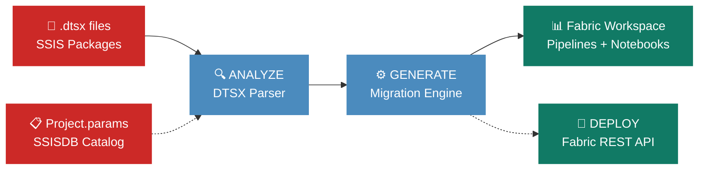
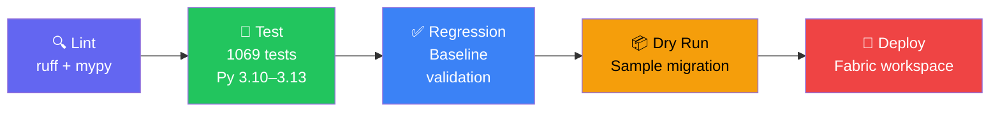

<p align="center">
  
  
  
</p>

<h1 align="center">SSIS to Microsoft Fabric Migration</h1>

<p align="center">
  <strong>Migrate your SSIS packages to Microsoft Fabric in seconds — Data Factory pipelines, Dataflow Gen2, and Spark notebooks.</strong>
</p>

<p align="center">
  <a href="https://github.com/cyphou/SSIS-To-Fabric/actions/workflows/ci.yml"></a>
  
  
  
  
  
  
</p>

<p align="center">
  <a href="#-quick-start">Quick Start</a> •
  <a href="#-key-features">Features</a> •
  <a href="#-how-it-works">How It Works</a> •
  <a href="#-ssis-component-support">Component Support</a> •
  <a href="#-deployment-phases">Deployment</a> •
  <a href="#-testing">Testing</a> •
  <a href="#-documentation">Docs</a>
</p>

---

## ⚡ Quick Start

```bash
# One command migration
ssis2fabric migrate path/to/ssis_project/ --strategy hybrid --output ./output
```

> [!TIP]
> The output includes Fabric JSON pipelines, PySpark notebooks, and Dataflow Gen2 definitions — ready for deployment.

<details>
<summary><b>📦 Installation</b></summary>

```bash
git clone <repo-url>
cd SSISToFabric

python -m venv .venv
.venv\Scripts\activate        # Windows
# source .venv/bin/activate   # Linux/Mac

pip install -e ".[dev]"
```

**Requirements:** Python 3.10+ • `lxml`, `pyyaml`, `pydantic`, `click`, `rich`

</details>

### More ways to migrate

```bash
# 🔍 Assess migration readiness
ssis2fabric assess path/to/ssis_project/

# 🔍 Analyze packages
ssis2fabric analyze path/to/ssis_project/

# 📋 Generate a plan without executing
ssis2fabric plan path/to/ssis_project/ --strategy hybrid

# 📋 Dry-run: show what would be generated
ssis2fabric migrate path/to/project/ --strategy hybrid --dry-run

# 🚀 Migrate + deploy to Fabric in one shot
ssis2fabric migrate path/to/project/ --strategy hybrid --output ./output
ssis2fabric deploy ./output --workspace-id <workspace-guid>

# 🔄 Extract packages from SSISDB catalog
ssis2fabric extract-ssisdb "Driver={ODBC Driver 17};Server=myserver;..." -o ./extracted

# ✅ Validate against approved baselines
ssis2fabric validate tests/regression/baselines/ output/
```

### Python API (recommended)

```python
from ssis_to_fabric import SSISMigrator

migrator = SSISMigrator(strategy="hybrid", output_dir="./output")
result = migrator.migrate("path/to/ssis_project/")
print(f"Generated {len([i for i in result.items if i.status == 'completed'])} artifacts")

# One-shot: migrate + deploy
migrator.run("path/to/ssis_project/", workspace_id="<workspace-guid>", clean=True)
```

---

## 🎯 Key Features

<table>
<tr>
<td width="50%">

### 🔄 28+ SSIS Components
Parses control flow & data flow tasks:
Execute SQL, Execute Package, ForEach/For Loop, Sequence Containers, Data Flow (OLE DB, Flat File, Excel, ODBC, XML, CDC), Script Components, File System, FTP, Send Mail

</td>
<td width="50%">

### ⚡ Expression Transpiler
Converts SSIS expressions to both targets:
Power Query M (`Text.Upper`, `DateTime.LocalNow`) and PySpark (`F.upper`, `F.current_timestamp`) — 40+ patterns including DATEADD, DATEDIFF, type casts, string ops

</td>
</tr>
<tr>
<td>

### 🔌 12 Connection Types
Handles all major SSIS connections:
OLEDB, ADO.NET, Flat File, Excel, ODBC, FTP, HTTP, FILE, SMTP, Oracle, SharePoint, Analysis Services — auto-mapped to Fabric connections

</td>
<td>

### 🚀 Multi-Phase Deployment
Automated deployment to Fabric:
Connection resolution → Folder creation → Dataflows → Notebooks → Leaf pipelines → Orchestrators — with dependency ordering & dry-run support

</td>
</tr>
<tr>
<td>

### 🧠 Smart Routing
Three migration strategies:
**Hybrid** (default) routes simple flows to Dataflow Gen2, complex to Spark. **Data Factory** for pipeline-only. **Spark** for transformation-heavy packages.

</td>
<td>

### 📋 Destination Sidecars
Every dataflow/notebook gets a `.destinations.json`:
Target table, column names, data types — enabling downstream Lakehouse provisioning without parsing M/PySpark code.

</td>
</tr>
</table>

> [!NOTE]
> **28 pipelines** and **28 notebooks** generated from the included real SSIS example projects (MIT licensed).

---

## 🔧 How It Works



**Step 1 — Analyze:** Parses SSIS `.dtsx` XML into structured models (tasks, data flows, connections, parameters)

**Step 2 — Generate:** Routes each task to the optimal Fabric artifact (Data Factory pipeline, Dataflow Gen2, or Spark notebook)

**Step 3 — Deploy** *(optional):* Multi-phase deployment to Fabric workspace with dependency resolution

### 📂 Generated Output

```
output/
├── pipelines/                              ← One JSON per SSIS package + Master orchestrator
│   ├── StgCustomer.json
│   └── EP_Staging_orchestrator.json
├── notebooks/                              ← PySpark notebooks for complex transforms
│   ├── StgCustomer_dft_Staging.py
│   └── StgCustomer_dft_Staging.destinations.json   ← Sidecar manifest
├── connections/                            ← Auto-discovered connection definitions
│   └── cmgr_Source.json
└── migration_report.json                   ← Full traceability: task → artifact mapping
```

---

## 🔧 Architecture

<details>
<summary><b>📁 Project structure</b> (click to expand)</summary>

```
SSISToFabric/
├── src/ssis_to_fabric/
│   ├── analyzer/                       # SSIS package parsing
│   │   ├── models.py                  #   Data models (SSISPackage, Variable, Task, etc.)
│   │   └── dtsx_parser.py            #   .dtsx XML parser + Project.params reader
│   ├── engine/                         # Migration generators
│   │   ├── migration_engine.py        #   Orchestration, routing & plan generation
│   │   ├── data_factory_generator.py  #   ADF pipeline JSON generation
│   │   ├── dataflow_generator.py      #   Dataflow Gen2 (Power Query M) + expression transpiler
│   │   ├── spark_generator.py         #   PySpark notebook + expression transpiler
│   │   ├── fabric_deployer.py         #   Fabric REST API deployment & folder organization
│   │   └── ssisdb_extractor.py        #   SSISDB catalog .dtsx extraction (pyodbc)
│   ├── testing/                        # Test framework
│   │   └── regression_runner.py       #   Non-regression baseline validation
│   ├── cli.py                          # CLI entry point (ssis2fabric)
│   ├── api.py                          # Public Python API (SSISMigrator facade)
│   ├── config.py                       # Configuration management
│   └── logging_config.py              # Structured logging (structlog)
├── tests/                              # 1069 tests across unit + regression
├── examples/                           # 12 scenarios + full SSIS project (28 packages)
├── azure-pipelines.yml                 # Azure DevOps CI/CD
├── .github/workflows/ci.yml           # GitHub Actions CI/CD
├── migration_config.yaml               # Default configuration
└── pyproject.toml                      # Python project config
```

</details>

---

## 📦 SSIS Component Support

<details>
<summary><b>📋 Full component mapping table</b> (click to expand)</summary>

| SSIS Component | Fabric Target | Notes |
|----------------|---------------|-------|
| Execute SQL Task | Script Activity | Query/NonQuery auto-classified; SSIS connection ref mapped; timeout set |
| Data Flow (OLE DB / ADO.NET) | Dataflow Gen2 | `Sql.Database()` / `Value.NativeQuery()` in M; Fabric Connection JDBC via `notebookutils.credentials` in PySpark |
| Data Flow (Flat File) | Dataflow Gen2 | `Csv.Document()` in M; `spark.read.csv()` in PySpark |
| Data Flow (Excel) | Dataflow Gen2 | `Excel.Workbook()` in M; `spark.read.format("excel")` in PySpark |
| Data Flow (ODBC) | Dataflow Gen2 | `Odbc.DataSource()` in M; `spark.read.format("jdbc")` in PySpark |
| Data Flow (XML) | Dataflow Gen2 | `Xml.Tables()` in M; `spark.read.format("xml")` in PySpark |
| Data Flow (Raw File) | Dataflow Gen2 | Binary read in M; Parquet fallback in PySpark (no direct equivalent) |
| Data Flow (CDC Source) | Dataflow Gen2 | Reads `cdc.<table>_CT`; TODO markers for LSN / `__$operation` filtering |
| Data Flow (SQL Server Dest) | Copy Activity | Fast-load destination → `SqlSink` |
| Data Flow (Recordset Dest) | Spark Notebook | In-memory destination; HIGH complexity |
| Data Flow + Derived Column | Dataflow Gen2 / Spark | SSIS expressions auto-transpiled to M or PySpark |
| Data Flow + Lookup | Dataflow Gen2 / Spark | Join keys & ref keys extracted from SSIS XML; `Table.NestedJoin` or `.join()` |
| Data Flow + Fuzzy Lookup | Spark Notebook | HIGH complexity; placeholder with metadata |
| Data Flow + Merge Join | Spark Notebook | Join type + left/right key columns fully extracted |
| Data Flow + Merge | Dataflow Gen2 / Spark | Sorted merge of two inputs |
| Data Flow + Aggregate | Dataflow Gen2 / Spark | Group-by + aggregations (sum/count/avg/min/max/count_distinct) extracted |
| Data Flow + Sort | Dataflow Gen2 / Spark | Sort columns + direction (asc/desc) extracted |
| Data Flow + Conditional Split | Dataflow Gen2 / Spark | Conditions extracted; `Table.SelectRows` or `df.filter()` generated |
| Data Flow + Copy Column | Dataflow Gen2 / Spark | Simple column duplication |
| Data Flow + Character Map | Dataflow Gen2 / Spark | Unicode case/width transforms |
| Data Flow + Audit | Dataflow Gen2 / Spark | System variable columns (PackageName, ExecutionTime, etc.) |
| Data Flow + SCD | Spark Notebook | SCD Type 2 merge pattern |
| Data Flow + CDC Splitter | Spark Notebook | Routes CDC rows by operation type; HIGH complexity |
| Data Flow + Fuzzy Grouping | Spark Notebook | HIGH complexity; placeholder with metadata |
| Data Flow + Percentage/Row Sampling | Dataflow Gen2 / Spark | Sampling transforms |
| Script Component (C#) | Spark Notebook (TODO stub) | Placeholder with original script reference |
| Execute Process Task | ExecutePipeline Activity | Placeholder sub-pipeline preserving original command |
| Send Mail Task | Office365Outlook Activity | To/CC/Subject/Body extracted from SSIS properties |
| Execute Package Task | ExecutePipeline Activity | Parameter bindings forwarded; waitOnCompletion = true |
| File System Task | TridentNotebook Activity | Operation mapped to `mssparkutils.fs.*` (cp/mv/rm/mkdirs) |
| FTP Task | Copy Activity / TridentNotebook | Send/Receive → Copy activity; other ops → Notebook placeholder |
| ForEach Loop Container | ForEach Activity | Enumerator type parsed (File/Item/ADO/NodeList/SMO/FromVariable); `items` expression auto-derived |
| For Loop Container | Until Activity | Loop expression converted |
| Sequence Container | Flattened with dependency graph | Children promoted to top-level with correct `dependsOn` |
| Precedence Constraints | `dependsOn` chains | Success/failure/completion semantics preserved |

</details>

### 🔌 Data Source & Connection Support

<details>
<summary><b>📋 Full data source mapping table</b> (click to expand)</summary>

| Source/Dest Type | Dataflow (M) | Spark (PySpark) | Copy Activity |
|------------------|-------------|-----------------|---------------|
| OLE DB | `Sql.Database()` | Fabric JDBC via `_jdbc_url_for()` | `SqlSource` / `SqlSink` |
| ADO.NET | `Sql.Database()` | Fabric JDBC via `_jdbc_url_for()` | `SqlSource` / `SqlSink` |
| Flat File | `Csv.Document()` | `spark.read.csv()` | `DelimitedTextSource` / `DelimitedTextSink` |
| Excel | `Excel.Workbook()` | `spark.read.format("excel")` | `ExcelSource` / `DelimitedTextSink` |
| ODBC | `Odbc.DataSource()` | `spark.read.format("jdbc")` | `OdbcSource` / `OdbcSink` |
| XML | `Xml.Tables()` | `spark.read.format("xml")` | `XmlSource` |
| Raw File | `Binary.Buffer()` | `spark.read.parquet()` (fallback) | — |
| CDC | `Sql.Database()` + CDC table | `spark.sql()` + CDC table | `SqlSource` + CDC query |
| SQL Server (fast) | — | — | `SqlSink` |

Connection types recognized by the parser: **OLEDB**, **ADO.NET**, **Flat File**, **Excel**, **ODBC**, **FTP**, **HTTP**, **FILE**, **SMTP**, **Oracle**, **SharePoint**, **Analysis Services**.

</details>

### 🔗 Parameter & Variable Support

The framework fully handles SSIS parameterization and parent-child orchestration:

| Feature | Details |
|---------|---------|
| **Package parameters** | Both SSIS 2012+ container format (`<DTS:PackageParameters>`) and loose format |
| **Project parameters** | `Project.params` file parsed; merged into all package pipelines |
| **Parameter metadata** | `DataType`, `Required`, `Sensitive`, `Description` preserved |
| **Execute Package bindings** | `<DTS:ParameterAssignment>` parsed and converted to `ExecutePipeline` parameters |
| **ADF expressions** | `$Package::VarName` references become `@pipeline().parameters.VarName` |
| **Variables** | SSIS variables (non-System) converted to pipeline variables |

### ⚡ SSIS Expression Transpiler

<details>
<summary><b>📋 Complete expression conversion table</b> (click to expand)</summary>

SSIS expressions in Derived Columns, Conditional Splits, and other transforms are automatically converted to both **Power Query M** and **PySpark**:

| SSIS Expression | Power Query M | PySpark |
|-----------------|---------------|----------|
| `GETDATE()` | `DateTime.LocalNow()` | `F.current_timestamp()` |
| `GETUTCDATE()` | `DateTimeZone.UtcNow()` | `F.to_utc_timestamp(...)` |
| `UPPER(col)` | `Text.Upper([col])` | `F.upper(F.col("col"))` |
| `LOWER(col)` | `Text.Lower([col])` | `F.lower(F.col("col"))` |
| `TRIM(col)` | `Text.Trim([col])` | `F.trim(F.col("col"))` |
| `LEN(col)` | `Text.Length([col])` | `F.length(F.col("col"))` |
| `REPLACE(col,a,b)` | `Text.Replace([col],a,b)` | `F.regexp_replace(...)` |
| `SUBSTRING(col,s,l)` | `Text.Middle([col],s-1,l)` | `F.substring(...)` |
| `ISNULL(col)` | `[col] = null` | `F.col("col").isNull()` |
| `(DT_STR,...) col` | `Text.From([col])` | `.cast("string")` |
| `(DT_I4) col` | `Int64.From([col])` | `.cast("int")` |
| `DATEADD("dd",n,col)` | `Date.AddDays(col,n)` | `F.date_add(...)` / `F.add_months(...)` |
| `DATEDIFF("dd",a,b)` | `Duration.Days(b - a)` | `F.datediff(...)` / `F.months_between(...)` |
| `DATEPART("yyyy",col)` | `Date.Year(col)` | `F.year(...)` / `F.month(...)` / ... |
| `YEAR/MONTH/DAY(col)` | `Date.Year/Month/Day(col)` | `F.year(...)` / `F.month(...)` / `F.dayofmonth(...)` |
| `REPLACENULL(col,v)` | `if col = null then v else col` | `F.coalesce(...)` |
| `NULL(DT_WSTR,n)` | — | `F.lit(None).cast("string")` |
| `LEFT/RIGHT(col,n)` | `Text.Start/End(col,n)` | `F.substring(...)` |
| `FINDSTRING(col,s)` | `Text.PositionOf(col,s)` | `F.locate(...)` |
| `TOKEN(col,d,n)` | `List.ItemAt(Text.Split(...))` | `F.split(...).getItem(...)` |
| `REVERSE(col)` | `Text.Reverse(col)` | `F.reverse(...)` |
| `ABS/CEILING/FLOOR(col)` | `Number.Abs/RoundUp/RoundDown` | `F.abs(...)` / `F.ceil(...)` / `F.floor(...)` |
| `ROUND(col,p)` | `Number.Round(col,p)` | `F.round(...)` |
| `POWER/SQRT/SIGN(col)` | `Number.Power/Sqrt/Sign` | `F.pow(...)` / `F.sqrt(...)` / `F.signum(...)` |
| `SIN/COS/TAN(col)` | `Number.Sin/Cos/Tan` | `F.sin(...)` / `F.cos(...)` / `F.tan(...)` |
| `ASIN/ACOS/ATAN(col)` | `Number.Asin/Acos/Atan` | `F.asin(...)` / `F.acos(...)` / `F.atan(...)` |
| `ATAN2(y,x)` | `Number.Atan2(y,x)` | `F.atan2(y,x)` |
| `LOG2(col)` | `Number.Log(...)` | `F.log2(...)` |
| `PI()` | `Number.PI` | `F.lit(3.14159...)` |
| `RAND()` | `Number.Random()` | `F.rand()` |
| `BITAND(a,b)` | `Number.BitwiseAnd(a,b)` | `.bitwiseAND(...)` |
| `BITOR(a,b)` | `Number.BitwiseOr(a,b)` | `.bitwiseOR(...)` |
| `BITXOR(a,b)` | `Number.BitwiseXor(a,b)` | `.bitwiseXOR(...)` |
| `(DT_R8) col` | `Number.From([col])` | `.cast("double")` |
| `(DT_BOOL) col` | `Logical.From([col])` | `.cast("boolean")` |
| `(DT_DECIMAL,s) col` | `Decimal.From([col])` | `.cast("decimal(38,s)")` |
| `(DT_NUMERIC,p,s) col` | `Decimal.From([col])` | `.cast("decimal(p,s)")` |
| `(DT_CY) col` | `Currency.From([col])` | `.cast("decimal(19,4)")` |
| `(DT_GUID) col` | `Text.From([col])` | `.cast("string")` |
| `(DT_BYTES,n) col` | `Binary.From([col])` | `.cast("binary")` |
| `cond ? a : b` | `if cond then a else b` | `F.when(...).otherwise(...)` |
| `a + b` (concat) | `a & b` | `F.concat(...)` |

Nested expressions are recursively transpiled: `UPPER(SUBSTRING(REPLACE(col, "a", "b"), 1, 5))` works in both targets.

Use `ExpressionTranspiler.validate(expr)` to detect unknown functions and unbalanced parentheses before migration.

</details>

### 🔗 Connection Mapping

SSIS connection manager names can be mapped to Fabric connection IDs via `migration_config.yaml`:

```yaml
connection_mappings:
  MyOLEDB_Source: "fabric-conn-guid-1"
  MyOLEDB_Dest:   "fabric-conn-guid-2"
```

When a mapping exists, the generated pipeline uses the Fabric connection ID directly instead of emitting a `TODO` placeholder.

### Destination Sidecar Manifests

Each generated dataflow and notebook gets an accompanying `*.destinations.json` sidecar:

```json
{
  "destinations": [
    {
      "table": "dw.DimCustomer",
      "connectionRef": "DW_Connection",
      "columns": [
        { "name": "CustomerKey", "dataType": "i4", "length": 0, "precision": 0, "scale": 0 },
        { "name": "CustomerName", "dataType": "str", "length": 100, "precision": 0, "scale": 0 }
      ]
    }
  ]
}
```

This enables downstream tooling (e.g. Lakehouse table creation scripts) to provision the target schema without parsing M code.

### Parallel & Sequential Semantics

Sequence containers are flattened into top-level pipeline activities with correct dependency resolution:

- **Container with no precedence constraints** → children run **in parallel** (all depend on preceding phase only)
- **Container with precedence constraints** → children follow the **constraint dependency graph**
- **Fan-in**: the next phase after a container depends on **all** leaf activities from that container

Example from the AdventureWorksDW Master ETL pipeline:

```
Initialize_ETL_Batch         → (no deps)
  Extract_Customers          → [Initialize_ETL_Batch]     ┐
  Extract_Products           → [Initialize_ETL_Batch]     ├─ parallel
  Extract_Orders             → [Initialize_ETL_Batch]     ┘
Load_DimDate                 → [all 3 extracts]           ← fan-in
  Load_DimCustomer           → [Load_DimGeography]        ┐
  Load_DimProduct            → [Load_DimGeography]        ├─ parallel
Load_FactInternetSales       → [all dim loads]            ┐
Load_FactResellerSales       → [all dim loads]            ├─ parallel
Phase_5_Post_Process         → [both fact loads]          ← fan-in
Finalize_ETL_Batch           → [Phase_5_Post_Process]
Send_Success_Notification    → [Finalize_ETL_Batch]
```

---

## 🔀 Migration Strategies

| Strategy | Description | Best For |
|----------|-------------|----------|
| **`hybrid`** (default) | Routes simple data flows to Dataflow Gen2, complex to Spark, control flow to pipelines | Most projects |
| **`data_factory`** | All tasks to Data Factory pipelines | Simple ETL packages |
| **`spark`** | All tasks to Spark notebooks | Complex transformation-heavy packages |

---

## 🚀 Deployment Phases

The deployer uses a multi-phase strategy that handles item dependencies and workspace organization:

| Phase | Action | Details |
|-------|--------|---------|
| **0** | Resolve connections | Auto-discovers SSIS connection managers from `.conmgr` files; matches existing Fabric SQL connections by server/database or creates new ones with WorkspaceIdentity |
| **0.5** | Pre-create folders | Creates one workspace folder per SSIS package before any items are deployed |
| **1a** | Deploy Dataflow Gen2 | Dataflows deployed first (no dependencies); each moved to its folder immediately |
| **1b** | Deploy Notebooks | PySpark notebooks deployed; each moved to its folder immediately |
| **1c** | Deploy leaf pipelines | Pipelines with no cross-pipeline references (no `ExecutePipeline` or `Copy` activities) |
| **1d** | Deploy Copy pipelines | Pipelines containing Copy activities deployed as empty shells (Fabric creates linked items) |
| **2** | Create referencing shells | Empty pipeline shells for orchestrators / `ExecutePipeline` parents (establishes item IDs) |
| **3** | Update definitions | Full pipeline definitions pushed with resolved `pipelineId` references |
| **4** | Move remaining items | Catch-all: moves any async-created items (HTTP 202) that weren't moved during their deploy phase |

Each item is moved into its workspace folder immediately after creation when the item ID is available (synchronous 201 responses). Items created asynchronously (202 responses) are caught in Phase 4.

---

## 💻 Python API

<details>
<summary><b>🔧 Full API reference</b> (click to expand)</summary>

All operations are available as importable classes — no CLI required:

```python
from ssis_to_fabric import SSISMigrator

# Create a migrator (strategy: "hybrid" | "data_factory" | "spark")
migrator = SSISMigrator(strategy="hybrid", output_dir="./output")

# 1. Analyze — parse SSIS packages
packages = migrator.analyze("path/to/ssis_project/")
for pkg in packages:
    print(f"{pkg.name}: {pkg.total_tasks} tasks, {pkg.total_data_flows} data flows")

# 2. Plan — generate a migration plan without executing
plan = migrator.plan(packages)
for item in plan.items:
    print(f"  {item.source_task} → {item.target_artifact.value}")

# 3. Migrate — parse, plan, and generate Fabric artifacts in one call
result = migrator.migrate("path/to/ssis_project/")
completed = [i for i in result.items if i.status == "completed"]
print(f"Generated {len(completed)} artifacts")

# 4. Deploy — push artifacts to a Fabric workspace
report = migrator.deploy(
    workspace_id="<workspace-guid>",
    clean=False,       # True = delete all items first
    dry_run=False,     # True = simulate only
)
print(f"{report.succeeded} deployed, {report.failed} failed")

# 5. Validate — compare output against approved baselines
results = migrator.validate("tests/regression/baselines/", "./output")
assert all(r["status"] == "pass" for r in results)
```

#### One-shot: migrate + deploy

```python
from ssis_to_fabric import SSISMigrator

migrator = SSISMigrator(strategy="hybrid", output_dir="./output")
migrator.run(
    "path/to/ssis_project/",
    workspace_id="<workspace-guid>",
    clean=True,
)
```

#### Using an existing configuration

```python
from ssis_to_fabric import SSISMigrator, load_config

config = load_config("migration_config.yaml")
migrator = SSISMigrator.from_config(config, strategy="hybrid")
result = migrator.migrate("path/to/ssis_project/")
```

#### Available types for advanced usage

```python
from ssis_to_fabric import (
    SSISMigrator,          # High-level facade
    MigrationConfig,       # Pydantic config model
    MigrationStrategy,     # Enum: HYBRID, DATA_FACTORY, SPARK
    MigrationEngine,       # Low-level orchestration engine
    MigrationPlan,         # Plan dataclass
    MigrationItem,         # Per-task item dataclass
    TargetArtifact,        # Enum: DATA_FACTORY_PIPELINE, DATAFLOW_GEN2, ...
    load_config,           # Config loader (YAML + env vars)
)
```

</details>

---

## 📝 CLI Reference

<details>
<summary><b>🔧 All CLI commands</b> (click to expand)</summary>

| Command | Description |
|---------|-------------|
| `ssis2fabric assess <path>` | Pre-migration readiness assessment with effort estimates |
| `ssis2fabric analyze <path>` | Parse SSIS packages and display migration assessment |
| `ssis2fabric plan <path>` | Generate a migration plan without executing |
| `ssis2fabric migrate <path>` | Full migration: analyze, plan, generate artifacts |
| `ssis2fabric deploy <output_dir>` | Deploy artifacts to a Fabric workspace |
| `ssis2fabric verify <output_dir>` | Verify deployed artifacts exist in workspace |
| `ssis2fabric validate <baseline> <output>` | Non-regression comparison against baselines |
| `ssis2fabric validate-config` | Validate migration configuration file |
| `ssis2fabric extract-ssisdb <conn_str>` | Extract .dtsx packages from SSISDB catalog |

```bash
# Analyze packages
ssis2fabric analyze path/to/ssis_project/

# Generate a plan
ssis2fabric plan path/to/ssis_project/ --strategy hybrid

# Execute full migration
ssis2fabric migrate path/to/ssis_project/ --strategy hybrid --output ./output

# Deploy to Fabric
ssis2fabric deploy ./output --workspace-id <workspace-guid>
ssis2fabric deploy ./output --workspace-id <guid> --dry-run   # simulate only

# Verify deployed artifacts exist in workspace
ssis2fabric verify ./output --workspace-id <workspace-guid>

# Validate against baselines
ssis2fabric validate tests/regression/baselines/ output/

# Extract packages from SSISDB catalog
ssis2fabric extract-ssisdb "Driver={ODBC Driver 17};Server=myserver;..." -o ./extracted
ssis2fabric extract-ssisdb "<conn-str>" --folder MyFolder --project MyProject
```

</details>

---

## 🧪 Testing

<p align="center">
  
  
  
</p>

```bash
pytest tests/ -v                                     # Run all 1069+ tests
pytest tests/unit/ -v                                # Unit tests only
pytest tests/unit/test_api.py -v                     # API facade tests
pytest tests/unit/test_automation_features.py -v     # Expression transpiler tests
pytest tests/regression/ -m regression -v            # Regression tests
pytest tests/ --cov=ssis_to_fabric --cov-report=html # Coverage report
```

<details>
<summary><b>📋 Test suite breakdown</b> (click to expand)</summary>

| Test File | Tests | Coverage |
|-----------|-------|----------|
| `test_spark_generator.py` | 91 | Notebook generation, transforms & code validity |
| `test_automation_features.py` | 63 | Expression transpiler, metadata wiring, sidecar, FS/FTP |
| `test_data_factory_generator.py` | 46 | Pipeline & folder organization |
| `test_data_sources.py` | 40 | ODBC/XML/CDC/Raw/type-aware generators |
| `test_dataflow_generator.py` | 36 | Dataflow Gen2 generation |
| `test_api.py` | 34 | Python API facade |
| `test_parameters_parent_child.py` | 27 | Parameter & parent-child bindings |
| `test_dtsx_parser.py` | 26 | SSIS XML parser |
| `test_migration_engine.py` | 19 | Engine routing & orchestration |
| `test_non_regression.py` | 14 | Baseline comparison (regression) |
| `test_config.py` | 6 | Configuration management |
| + more | — | Additional edge case tests |

</details>

### CI/CD Pipeline



---

## 📦 Real SSIS Project Examples

The `examples/full_ssis_project/` directory contains **28 real Visual Studio-generated SSIS packages**
from the [SQL Server 2017 Integration Services Cookbook](https://github.com/PacktPublishing/SQL-Server-2017-Integration-Services-Cookbook)
(MIT License).

<details>
<summary><b>📋 SSISCookbook — 13 packages + orchestrator</b></summary>

Complete staging ETL project with shared connection managers (`.conmgr`), sample CSV/XML data,
and `EP_Staging.dtsx` as the Execute-Package orchestrator.

| Package | Key Components |
|---------|---------------|
| EP_Staging | Execute Package tasks (calls all Stg* packages) |
| StgCustomer | OLE DB Source → Data Conversion → OLE DB Destination |
| StgSalesOrderHeader | OLE DB Source → Derived Column → OLE DB Destination |
| StgProduct | OLE DB Source → Data Conversion → OLE DB Destination |
| ... (10 more) | Staging loads with various transforms |

</details>

<details>
<summary><b>📋 AdventureWorksETL — 4 packages</b></summary>

| Package | Key Components |
|---------|---------------|
| CascadingLookup | OLE DB + Flat File sources, cascading Lookups |
| ExecutionTrees | Pipeline execution tree demonstration |
| LookupCache | Lookup with Cache transform |
| LookupExpression | Lookup with expression-based connection |

</details>

<details>
<summary><b>📋 Additional Packages — 11 standalone</b></summary>

| Package | Key Components |
|---------|---------------|
| ProcessingExcel | Excel Source (Jet OLE DB) |
| DataMatching | Fuzzy Grouping + Fuzzy Lookup |
| TermExtractionLookup | Term Extraction + Term Lookup |
| SplitData | Conditional Split + Percentage Sampling |
| CustomWebServiceSource | Script Component as Web Service source |
| RegExValidation | Script Component with Regex |
| SecureFtpTask | FTP Task (SFTP) |
| FileSizes | Script Task + ForEach Loop |
| UsingVariables | Variable manipulation |
| DataMining | Data Mining model training |
| DataProfiling | Data Profiling task |

</details>

---

## 🏗️ Extending

<details>
<summary><b>🔧 Adding new SSIS components</b></summary>

1. Add the component type to `DataFlowComponentType` in `src/ssis_to_fabric/analyzer/models.py`
2. Add the class ID mapping in `COMPONENT_CLASS_MAP` in `src/ssis_to_fabric/analyzer/dtsx_parser.py`
3. Add metadata extraction in `_extract_component_metadata()`
4. Add generation logic in the appropriate generator (M in `dataflow_generator.py`, PySpark in `spark_generator.py`)
5. Add unit tests and update regression baselines

</details>

<details>
<summary><b>🔧 Adding new expression patterns</b></summary>

The expression transpilers are in:
- `DataflowGen2Generator._ssis_expr_to_m()` — converts SSIS expressions to Power Query M
- `SparkNotebookGenerator._ssis_expr_to_pyspark()` — converts SSIS expressions to PySpark

Both use regex pattern matching. Add new patterns as `re.sub` or `re.match` blocks.

</details>

<details>
<summary><b>🔧 Adding new control-flow task types</b></summary>

1. Add the task class name in `TASK_CLASS_MAP` in `src/ssis_to_fabric/analyzer/dtsx_parser.py`
2. Add a `_parse_<task>()` method to extract properties from `<ObjectData>`
3. Wire the parse call in `_parse_executable()`
4. Add a `_<task>_to_activity()` method in `src/ssis_to_fabric/engine/data_factory_generator.py`
5. Wire both routed and non-routed dispatch

</details>

---

## 📚 Documentation

| Document | Description |
|----------|-------------|
| 📖 [README](README.md) | This file — full project overview |
| 🤝 [Contributing](CONTRIBUTING.md) | Development setup and guidelines |
| 📝 [Changelog](CHANGELOG.md) | Release history |
| 📋 [Examples](examples/README.md) | Migration scenario guide |

---

## 🗺️ Roadmap

> Phases 1–6 are complete. The following phases are planned — see [CHANGELOG.md](CHANGELOG.md) for details.

| Phase | Name | Version | Focus |
|-------|------|---------|-------|
| ~~1~~ | ~~Hardening~~ | ~~1.2.0~~ | ~~Expression parity, error handling, retry, structured errors~~ |
| ~~2~~ | ~~Ecosystem~~ | ~~1.2.0~~ | ~~Lakehouse provisioner, HTML report, lineage, PyPI, Docker~~ |
| ~~3~~ | ~~Enterprise~~ | ~~1.2.0~~ | ~~C# transpiler, multi-workspace, incremental migration~~ |
| ~~4~~ | ~~Multi-Agent~~ | ~~1.2.0~~ | ~~Parallel agent orchestration (DataflowAgent, SparkAgent, PipelineAgent)~~ |
| ~~5~~ | ~~Quality~~ | ~~1.3.0~~ | ~~Event handlers, assessment scoring, config validation, dry-run~~ |
| ~~6~~ | ~~Fidelity & Scale~~ | ~~1.4.0~~ | ~~SQL injection fix, shared utils, DAG-aware Spark, unified transpiler~~ |
| **7** | **Observability** ✅ | 1.5.0 | Correlation IDs, per-artifact timing, audit logging, progress callbacks, SVG report charts |
| **8** | **Transpiler Completeness** ✅ | 1.6.0 | Bitwise ops, recursive nesting, C# AST transpiler, expression validation, trig/math functions |
| **9** | **Plugin Architecture** ✅ | 1.7.0 | Component handler registry, custom transpilers, hook system, entry_points |
| **10** | **Advanced SSIS** ✅ | 1.8.0 | Transactions, checkpoints, disabled tasks, logging providers, WMI/WebService/XML |
| **11** | **Column Lineage** | 1.9.0 | Column-level lineage, transformation tracking, D3.js Sankey visualization |
| **12** | **Deploy Hardening** | 2.0.0 | Blue-green deployment, rollback CLI, rate limiting, state machine |
| **13** | **Testing & Quality** | 2.1.0 | Hypothesis fuzzing, mutation testing, E2E harness, benchmarks |
| **14** | **Integrations** | 2.2.0 | Key Vault, Power BI, dbt, Slack/Teams webhooks, GitHub Action |
| **15** | **Enterprise Scale** | 2.3.0 | RBAC, multi-tenant, queue-based orchestration, horizontal scaling |
| **16** | **Developer Experience** | 2.4.0 | Sphinx docs, ADRs, migration cookbook, JSON Schema, VS Code extension |

---

## ⚠️ Known Limitations

| Area | Limitation | Workaround |
|------|-----------|------------|
| **Script Tasks** | C# → Python transpilation is regex-based; complex .NET code produces `# TODO` stubs | Manual review of generated Python skeletons |
| **Expressions** | Bitwise operators (`BITAND`, `BITOR`, `BITXOR`) not yet supported | Manual conversion (Phase 8) |
| **Event Handlers** | Only `OnError` fully converted; other handlers emit placeholder Wait activities | Review and customize generated placeholders |
| **SCD** | Only Type 2 supported; Type 1/3+ produce skeletons | Extend merge logic manually |
| **Lineage** | Table-level only; no column-level tracking | Column lineage planned for Phase 11 |
| **Nested Containers** | Sequence containers are flattened (no true nesting) | Dependency graph preserves execution order |

---

## 🤝 Contributing

Contributions are welcome! See [CONTRIBUTING.md](CONTRIBUTING.md) for guidelines.

```bash
git clone <repo-url>
cd SSISToFabric
pip install -e ".[dev]"
pytest tests/ -v  # Make sure tests pass
```

---

<p align="center">
  <sub>Built with ❤️ for the Microsoft Fabric community</sub><br/>
  <sub>If this tool saves you time, consider giving it a ⭐</sub>
</p>

## License

MIT
